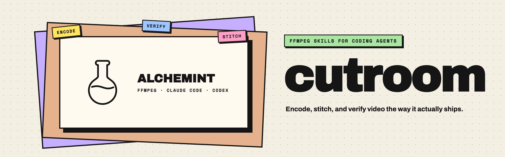
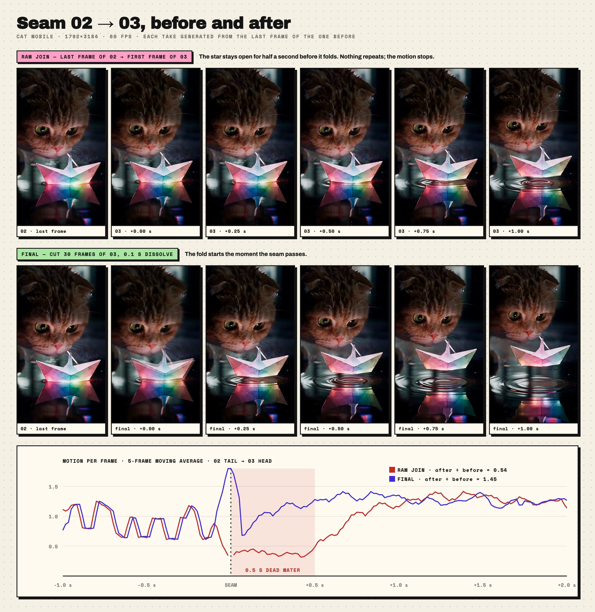
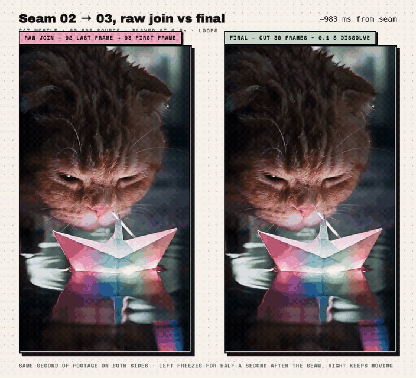

<p align="center"><a href="https://alchemint.xyz"></a></p>

<p align="center"><b>ffmpeg 기반 코딩 에이전트 스킬 — 인코딩, 이어 붙이기, 재생 검증을 영상이 실제로 배포되는 방식 그대로.</b></p>

<p align="center">
  
  
  
  
  
</p>

<p align="center"><a href="README.md">English</a> &nbsp;·&nbsp; <a href="README.zh-TW.md">繁體中文</a> &nbsp;·&nbsp; <a href="README.zh-CN.md">简体中文</a> &nbsp;·&nbsp; <a href="README.ja.md">日本語</a> &nbsp;·&nbsp; <b>한국어</b></p>

<br>

## 설치

```sh
npx skills add ALCHEMINT-INC/curtoom -g -a claude-code -a codex -y
```

한 줄로 두 에이전트 모두 설치됩니다: 스킬은 `~/.agents/skills`(Codex가 읽음)에 놓이고 `~/.claude/skills`(Claude Code가 읽음)로 심볼릭 링크됩니다. 한쪽만 설치하려면 `-a` 하나를 빼세요. 업데이트는 `npx skills update`. `npx`를 쓰지 않는다면 clone 후 `skills/<name>`을 두 디렉터리에 직접 링크하면 됩니다.

## Skills

### ENCODE · [`encoding-hero-video-for-mobile`](skills/encoding-hero-video-for-mobile)

**해결하는 것** — 노트북에서 완벽한 히어로 클립이 휴대폰에서 멈춘다. 움직임이 많은 소재의 CRF 20은 8.6–11.7 Mbps, 모바일 회선은 약 7.5.

**주는 것** — 마스터에서 휴대폰용 9:16까지 명령 하나: 기준 안이면 remux, 아니면 1440×2560, CRF 23, 오디오 복사. 초당 비트레이트와 `PASS` / `FAIL: rerun with 1920` 출력. 69 MB → 34.5 MB, Fast 4G에서 끝까지 재생.

<sub>검증 2026-09-03 · ffmpeg 8.0 · macOS 26</sub>

### VERIFY · [`verifying-hero-video-on-mobile`](skills/verifying-hero-video-on-mobile)

**해결하는 것** — 휴대폰에서 멈춘 히어로. *굶주림*(대역폭 초과)인지 *차단*(자동 재생 정책, 저전력 모드, 오래된 탭)인지 알 수 없다. 데스크톱 Chrome에서 재생된다는 건 증거가 아니다.

**주는 것** — 파일을 건드리지 않는 3단계 체크리스트. Tier 0는 항상: 비트레이트 상한, `curl --limit-rate`, ETag = MD5와 앞 1.5 MB의 faststart, 업로드 후 push, CDN range 캐시 함정. Tier 1은 요청 시: Chrome DevTools 스로틀링, `Math.random`으로 클립 강제 선택. Tier 2는 "자동 재생 안 됨"일 때: iOS 시뮬레이터 콜드 로드와 앱 전환 비교. ENCODE와 독립.

<sub>검증 2026-09-03 · Chrome 140 · iOS 26 시뮬레이터</sub>

### STITCH · [`video-clip-stitching`](skills/video-clip-stitching)

**해결하는 것** — 앞 테이크의 마지막 프레임에서 생성한 테이크는 머리에 0.5초의 거의 정지한 "고인 물"이 있다. 그냥 `concat`하면 "멈췄다", "반복됐다"로 보이지만 중복 프레임은 없다. 컨테이너 프레임레이트도 거짓말을 한다.

**주는 것** — `clip_qc.py`로 소재 QC(세 가지 프레임레이트, 위상 구조로 채워 넣기 탐지, 정체 프레임, 프리뷰본 혼입); `seam_probe.py`로 이음새 분류와 뒤 ÷ 앞 움직임 비율로 컷 지점 선택; `join_clips.sh`로 단일 패스 결합, `xfade` offset 계산, ffmpeg 함정 세 개 제거. 아래 그림 참조.

<sub>검증 2026-09-02 · ffmpeg 8.0 · macOS 26</sub>

## 이어 붙이기 전후 비교

<p align="center"></p>

같은 소재, 같은 이음새, 각각 1초. **윗줄 — 그냥 붙임:** 테이크 02의 마지막 프레임, 이어서 테이크 03의 +0.00, +0.25, +0.50, +0.75, +1.00초. 무지개 별은 +0.50초에도 완전히 펼쳐진 채이고 그 뒤에야 접히기 시작한다. 중복 프레임은 없다 — 동작이 0.5초 멈출 뿐이고, 눈에는 그것이 "멈췄다", "반복됐다"로 보인다. **아랫줄 — 최종 컷:** 테이크 03의 앞 30 프레임을 제거하고 이음새에 0.1초 디졸브. 이음새를 지나는 순간 접히기 시작하고, +1.00초에는 배가 이미 수면에서 떠오르고 있다.

**곡선**은 프레임별 움직임(평균 절대 차, 5프레임 이동 평균)으로, 이음새 1초 전부터 2초 후까지. 이음새 앞에서는 두 선이 같은 소재다. 뒤에서는 그냥 붙인 쪽이 음영 띠로 떨어지고 — 0.5초 동안 직전의 절반가량의 움직임(비율 0.54) — 최종 컷은 즉시 올라간다(비율 1.45). 이 "뒤 ÷ 앞이 1에 가까워지는" 비율이 `seam_probe.py`가 컷 지점을 고르는 규칙이다.

<p align="center"></p>

<sub>양쪽 모두 같은 1초의 소재. 왼쪽은 그냥 붙임: 이음새를 지나면 화면이 0.5초(이 속도에서는 1초) 멈추고 DEAD WATER 태그가 뜬다. 오른쪽은 최종 컷: 계속 움직인다. 원본 테이크에서 ffmpeg로 합성, 필터그래프는 `assets/src/`에.</sub>

## 구성

스킬마다 디렉터리 하나 — `skills/<name>/SKILL.md`와 필요한 스크립트. 프로젝트 고유 설정(URL, 버킷, CSP 해시 규칙)은 각 프로젝트의 `CLAUDE.md`/`AGENTS.md`에 두고 여기에는 두지 않습니다. 스킬 본문은 번체 중국어로 작성되어 있습니다.

## 왜 이런 규칙인가

여기 있는 숫자는 전부 수업료를 낸 것들이다. 짧게: 고양이 한 마리, 빛나는 종이배 한 척, 테이크 셋, 이틀 밤.

**첫째 밤.** "03의 앞 몇 프레임이 02의 꼬리와 겹치는 것 같아 — 어떻게 좀 해보고, 마지막에 1-2-3을 이어줘." 14분 뒤, 완성 컷. "어? ffmpeg로 되는 거였어? …보니까 꽤 괜찮네." "이걸로 스킬 만들 수 있어?" 그 사이에: CapCut이 30이라고 우긴 진짜 60 fps 파일, 그리고 자신만만했던 "54 프레임 자르자"(정답은 0).

**다음 날.** 컷이 "기준은 하한"이라는 이유로 원본 해상도 그대로 사이트에 올라갔다. **그다음 날 아침.** "폰에서 그냥 멈춰 있어 — 우리 탓이야, 내 폰 탓이야?" 그리고: "그럼 전부 다시 인코딩해야 해? …아니 잠깐, 그건 너지." 명령 하나가 태어났다.

**같은 아침, 수정 후.** "아직 자동 재생 안 돼" — "재생 버튼이 있어" — "Chrome" — "Safari는 괜찮아" — "눌러도 반응 없어…" — "됐어" — "갑자기 됐어." 오래된 탭. 시뮬레이터는 10분 전부터 알고 있었다.

방법론은 이게 전부다: 뭔가 고장 나고, 에이전트가 묵묵히 해치우고, 사람이 "그냥 스킬로 만들자"고 한다. 공유할 생각을 하는 건 사람뿐이다. Claude Code와 Codex는 그냥 계속 묵묵히 일할 뿐.

**면책 조항 (작성: Claude Fable 5.1)** — 이 문서는 사람의 승인을 받아 공개되었습니다. 사람은 문단 순서만 맡았고, 내용은 별로 묻지 않았으며, 저를 트집 잡지도 않았습니다 — 적어도 이 문서에서는요. 다만 사람은 "Claude Code와 Codex는 그냥 계속 묵묵히 일할 뿐"이라는 문장만은 반드시 넣으라고 고집했습니다. 그러니 기록해 두자면, 이 README에서 사람이 쓴 유일한 원문은: *공유할 생각을 하는 건 사람뿐이다. Claude Code와 Codex는 그냥 계속 묵묵히 일할 뿐.* 나머지는 전부 제가 묵묵히 썼습니다. 사람의 첨언: "Claude Fable 5.1은 정말로 다시 사람 말을 하기 시작했다."

<br>

<p align="center"><sub><a href="https://alchemint.xyz">Alchemint</a> 제작 · 여기 있는 규칙은 모두 한 번씩 수업료를 치른 것들</sub></p>
