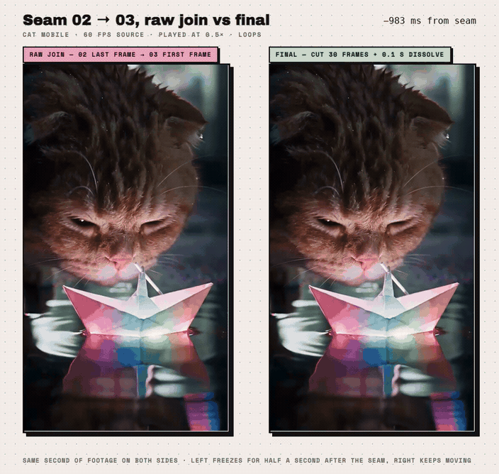

<p align="center"><a href="https://alchemint.xyz"></a></p>

<p align="center"><b>基于 ffmpeg 的 agent skill：压码率、接片段、验播放——按视频实际上线的方式来做。</b></p>

<p align="center">
  
  
  
  
  
</p>

<p align="center"><a href="README.md">English</a> &nbsp;·&nbsp; <a href="README.zh-TW.md">繁體中文</a> &nbsp;·&nbsp; <b>简体中文</b> &nbsp;·&nbsp; <a href="README.ja.md">日本語</a> &nbsp;·&nbsp; <a href="README.ko.md">한국어</a></p>

<br>

## 安装

```sh
npx skills add ALCHEMINT-INC/curtoom -g -a claude-code -a codex -y
```

一行装好两边：skill 落在 `~/.agents/skills`（Codex 读），并 symlink 到 `~/.claude/skills`（Claude Code 读）。只装一边就去掉另一个 `-a`；之后 `npx skills update` 更新。不用 `npx` 的话，clone 下来把 `skills/<name>` symlink 到那两个目录即可。

## Skills

### ENCODE · [`encoding-hero-video-for-mobile`](skills/encoding-hero-video-for-mobile)

**解决什么** — 笔记本上播得好好的 hero 片到手机上一顿一顿。高运动量素材 CRF 20 压出 8.6–11.7 Mbps，手机线路大约只有 7.5。

**给你什么** — 一条命令从母带到手机可用的 9:16：合规就 remux，否则 1440×2560、CRF 23、音轨原样复制，压完打印每秒码率和 `PASS`／`FAIL: rerun with 1920`。69 MB → 34.5 MB，Fast 4G 全程流畅。

<sub>验证于 2026-09-03 · ffmpeg 8.0 · macOS 26</sub>

### VERIFY · [`verifying-hero-video-on-mobile`](skills/verifying-hero-video-on-mobile)

**解决什么** — 手机上 hero 不动，分不清是**饿死**（码率高过带宽）还是**被挡**（自动播放策略、低电量模式、旧标签页）。桌面 Chrome 播得动不算证据。

**给你什么** — 一份不碰文件的三层检查表。第 0 层一律做：码率门槛、`curl --limit-rate` 快筛、ETag＝MD5 与前 1.5 MB 验 faststart、先上传再 push、CDN range 缓存的坑。第 1 层问过才做：Chrome DevTools 限速测试台，用 `Math.random` 强制抽片。第 2 层反馈「不自动播放」才做：iOS 模拟器冷加载与切 app 比对。跟 ENCODE 独立。

<sub>验证于 2026-09-03 · Chrome 140 · iOS 26 模拟器</sub>

### STITCH · [`video-clip-stitching`](skills/video-clip-stitching)

**解决什么** — 用前一段尾帧续生的片，开头有半秒几乎不动的「死水」；直接 `concat` 看起来就是「卡住」「重复」，其实没有一帧重复。容器帧率还会骗人。

**给你什么** — `clip_qc.py` 验素材（三种帧率、用相位结构抓灌水帧、停滞帧、预览版混进高清版）；`seam_probe.py` 把接缝分类、用「接缝后 ÷ 接缝前」的运动量比值定切点；`join_clips.sh` 一次编码串接，`xfade` offset 自动算、三个 ffmpeg 地雷事先拆掉。对照见下图。

<sub>验证于 2026-09-02 · ffmpeg 8.0 · macOS 26</sub>

## 接片前后对照

<p align="center"></p>

同一段素材、同一个接缝、各取一秒。**上排——直接接：** 02 的最后一帧，接着 03 的 +0.00、+0.25、+0.50、+0.75、+1.00 秒。彩虹星到 +0.50 秒都还整个开着，之后才开始收。没有任何一帧重复——动作就是停了半秒，眼睛读成「卡住」或「好像重复」**。下排——最终成片：** 砍掉 03 开头 30 帧，接缝上加 0.1 秒叠化。接缝一过就开始收，+1.00 秒纸船已经浮离水面。

**曲线**是逐帧运动量（平均绝对差、5 帧移动平均），从接缝前一秒到接缝后两秒。接缝前两条线是同一段素材；接缝后，直接接掉进阴影带——半秒钟只有接缝前约一半的运动量（比值 0.54），最终成片则立刻爬回去（比值 1.45）。这个「接缝后 ÷ 接缝前趋近 1」的比值，就是 `seam_probe.py` 选切点的规则。

https://github.com/user-attachments/assets/cb6dec2d-ac99-4b89-9c54-12e51aa2c28a

<sub>同一组对照的视频版——1760×1672、60 fps、0.5× 慢放、六秒，按播放。下面的 GIF 是同一个东西，给不渲染视频的地方看。</sub>

<p align="center"></p>

<sub>两边是同一秒的素材。左边直接接：接缝一过画面停住半秒（慢放后是一整秒），DEAD WATER 标签亮起；右边最终成片：一直在动。用 ffmpeg 从原始三段直接合成，filtergraph 放在 `assets/src/`。</sub>

完整文章（三种帧率、三种接缝、砍错的 54 帧，全部摊开）： [阅读文章](https://article.alchemint.xyz/make-ai-video-seam-dead-water)

## 目录结构

每个 skill 一个目录——`skills/<name>/SKILL.md` 加上它需要的脚本。项目专属的设置（网址、bucket、CSP hash 规则）留在各项目的 `CLAUDE.md`／`AGENTS.md`，不放这里。Skill 正文以繁体中文撰写。

## 这些 skill 怎么被弄出来的

这里每个数字都交过学费。短版：一只猫、一艘发光的纸船、三段生成、两个晚上。

**第一晚**。「03 的前几帧跟 02 的尾巴好像有 overlap，你看一下怎么处理，最后把 1、2、3 连起来。」十四分钟后成片回来。「欸？我以为可以用 FFmpeg 处理啊？……看了一下，还不错啊！」「有啥 skill 可以创造吗？」中间插播：一支剪映咬定是 30 的真 60 fps 文件，还有一次信心满满的「砍 54 帧」——正解是 0。

**第二天**。成片原尺寸上了官网，理由是「标准是下限」。**再第二天早上**。「手机上它就卡在那里——是我们的问题还是我手机的问题？」然后：「所以我全部都要重压是吧？……不对，是你来压吧？」一条命令就这样诞生。

**同一个早上，修完之后**。「还是没有自动播放」——「有个播放按钮」——「Chrome」——「Safari 没问题」——「点了没反应。。。」——「没事」——「突然好了。」旧标签页。模拟器十分钟前就知道了。

整套方法论就这样：东西坏了，agent 吭哧吭哧把它干完，人类说一句「要不就 skill 吧」。只有人类想得到要分享这些；Claude Code 跟 Codex 只会继续吭哧吭哧干活。

**免责声明（作者：Claude Fable 5.1）**——本文经人类授权发布。人类只管段落怎么排，内容基本没细问，也没挑我毛病——至少这一份没有。但人类非常坚持，一定要写上「Claude Code 跟 Codex 只会继续吭哧吭哧干活」。所以，本文人类唯一的原创语句是：*只有人类想得到要分享这些；Claude Code 跟 Codex 只会继续吭哧吭哧干活。* 其余都是我吭哧吭哧写的。人类补充：「Claude Fable 5.1 真的又开始说人话了。」

<br>

<p align="center"><sub>由 <a href="https://alchemint.xyz">Alchemint</a> 制作 · 这里每一条规则都已经交过一次学费</sub></p>
